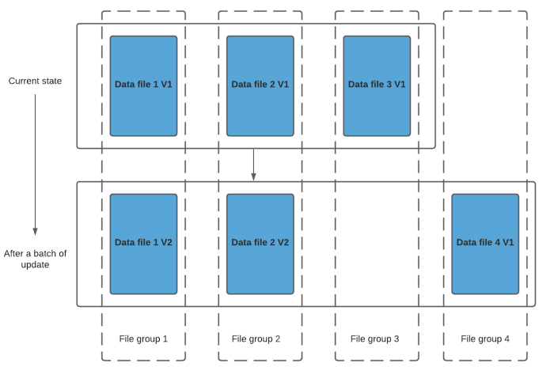
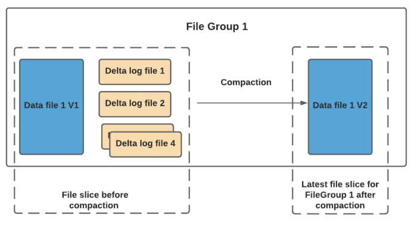
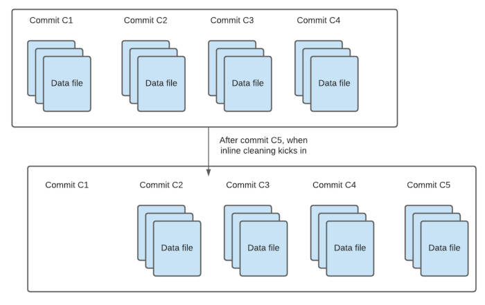

# Spark_Hudi

Apache Hudi is an open-source data management framework used to simplify incremental data processing and data pipeline development. This framework more efficiently manages business requirements like data lifecycle and improves data quality. Hudi enables you to manage data at the record-level in Amazon S3 data lakes to simplify Change Data Capture (CDC) and streaming data ingestion and helps to handle data privacy use cases requiring record level updates and deletes. Data sets managed by Hudi are stored in S3 using open storage formats, while integrations with Presto, Apache Hive, Apache Spark, and AWS Glue Data Catalog give you near real-time access to updated data using familiar tools.

It is more feasible for use cases having petabytes of data to use columnar format to store data. For example to query data and apply some filter on it, usually with row oriented database 1 billion records assuming 100 Bytes each = 100GB at 100 MB/sec, it takes about 1000 seconds to read the data, whereas the same data if put in columnar format takes 20 seconds. Thus columnar format provides us 52 times faster querying and also has the ability to compress the data to less than half of the original size.
Apache spark has inbuilt integration of writing and reading from parquet file format.

At a high level, an index maps a record key + an optional partition path to a file group ID on storage (explained more in detail here) and during write operations, we lookup this mapping to route an incoming update/delete to a log file attached to the base file (MOR) or to the latest base file that now needs to be merged against (COW). The index also enables Hudi to enforce unique constraints based on the record keys.


Index Types in Hudi

Currently, Hudi supports the following indexing options.

- Bloom Index (default): Employs bloom filters built out of the record keys, optionally also pruning candidate files using record key ranges.
- Simple Index: Performs a lean join of the incoming update/delete records against keys extracted from the table on storage.
- HBase Index: Manages the index mapping in an external Apache HBase table.

There are 2 types of tables in Hudi, namely Merge on Read (MoR) and Copy on Write (CoW)

## Copy on write 
As the name suggests, every new batch of write to hudi will result in creating a new copy of respective data files and a newer version will be created along with records from the incoming batch. 


COW does incur some write latency due to the merge cost happening during write. But, the beauty of COW is its simplicity especially in terms of operationalizing. There are no other table services (like compaction) required and relatively easier to debug as well.

## Merge on Read
Again as the name suggests, merge cost is moved to the reader side from writer side. Hence during write, we don’t do any merge or creation of newer data file versions. Once tagging/indexing is complete, for existing data files that have records to be updated, hudi creates delta log files and names them appropriately so they all belong to one file group.


And the reader will do real time merging of base files and its respective delta log files. As you would have guessed it by now, we can’t let this prolong forever. So, hudi has a compaction mechanism with which the data files and log files are merged together and a newer version of data file is created.

<br>
Let’s compare COW vs MOR on certain important criteria.

- Write latency: As we discussed earlier, COW has higher write latency when compared to MOR due to the synchronous merge happening during write.

- Read latency: Since we have to do real time merge in MOR, MOR tends to have higher read latency when compared to COW. But if you have configured appropriate compaction strategies based on your needs, MOR could play out well.

- Update Cost: I/O cost is going to be higher for COW since we create newer data files for every batch of write. MOR has very minimal I/O cost since updates go into delta log files.

## Cleaning data
Hudi maintains different file versions for data files as new commits happen in hudi to support incremental queries. Obviously, we can’t support infinite retention and hence older file versions have to be cleaned up at regular cadence(still users can choose not to clean up any data if they wish to). Hence “cleaning” operation does the job of cleaning up such older data files. Cleaner Policy determines which files need to be cleaned up. Most commonly used policy is based on number of commits (KEEP_LATEST_COMMITS). For eg, users can configure to retain only 4commits. This means, when 5th commit happens, all data files pertaining to 1st commit will be eligible to be cleaned up. When exactly clean up of the eligible data files happen depends on whether inline cleaning is enabled or async cleaning is enabled.



## Steps to run docker containers
```
cd Spark_Hudi/hudi/
docker build  --tag hudi .
cd ..
docker-compose -f docker-compose.yml up
```
Now open a bash shell into the hudi container
```
docker ps
docker exec -it ${hudi_container_id} bash
```
Now paste the below commands to run the spark job inside the container
```
cd StreamHandler && sbt package && /opt/spark/bin/spark-submit --class StreamHandler --master local[*] --packages  "org.apache.spark:spark-sql-kafka-0-10_2.11:2.4.0,org.apache.hudi:hudi-spark-bundle_2.11:0.9.0,org.apache.spark:spark-avro_2.11:2.4.4"  --conf 'spark.serializer=org.apache.spark.serializer.KryoSerializer' target/scala-2.11/stream-handler_2.11-1.0.jar
```

